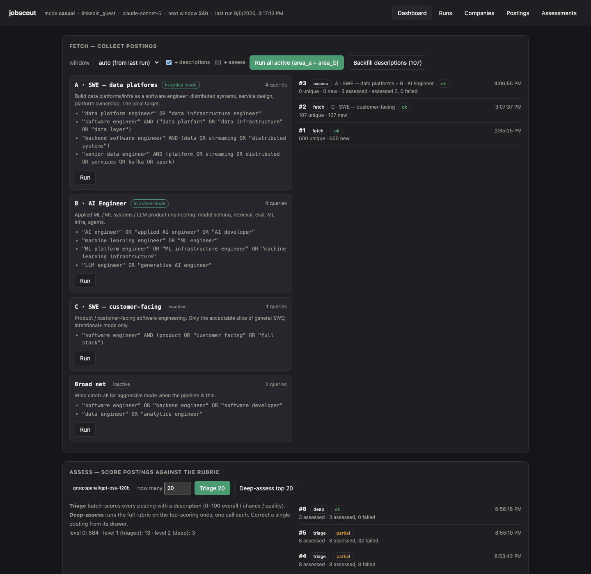
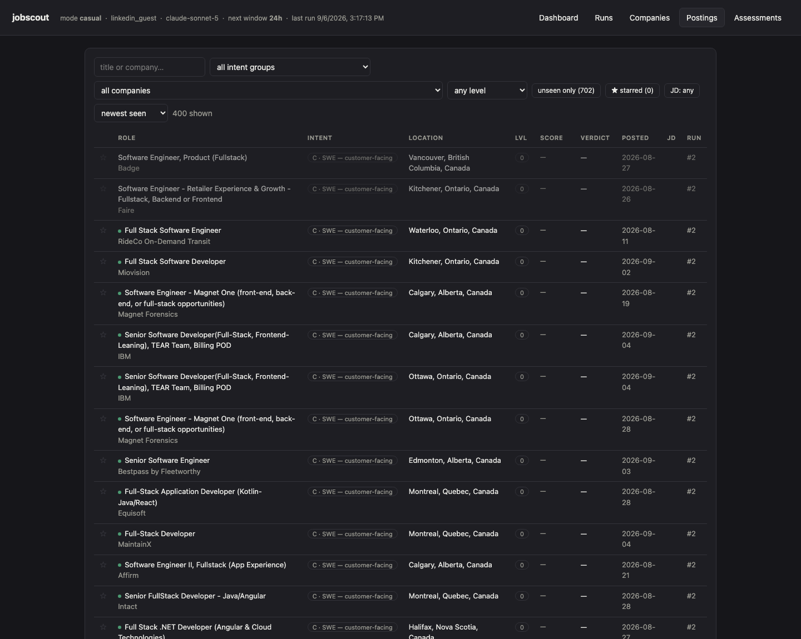
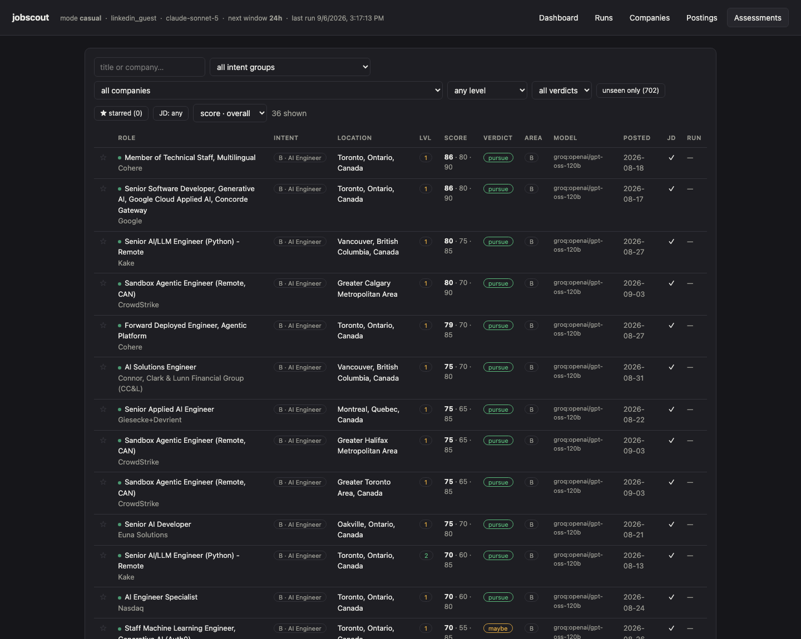
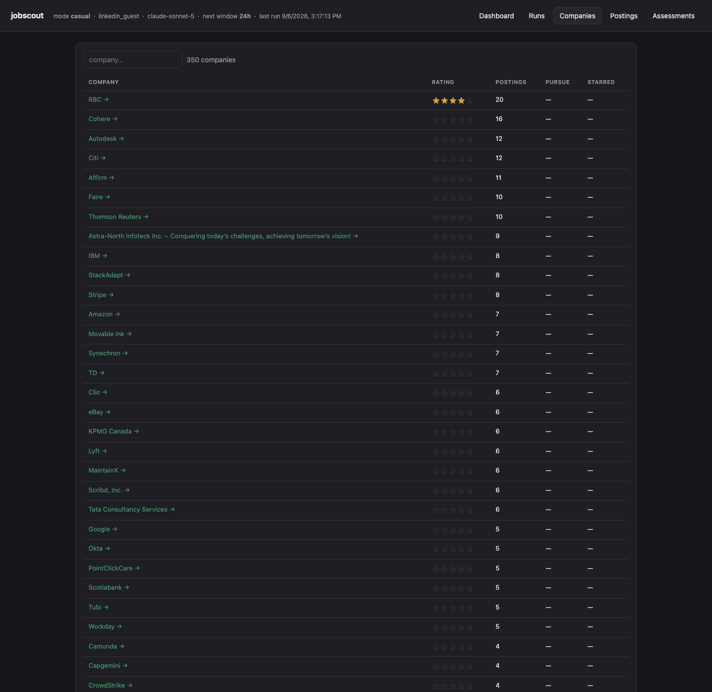
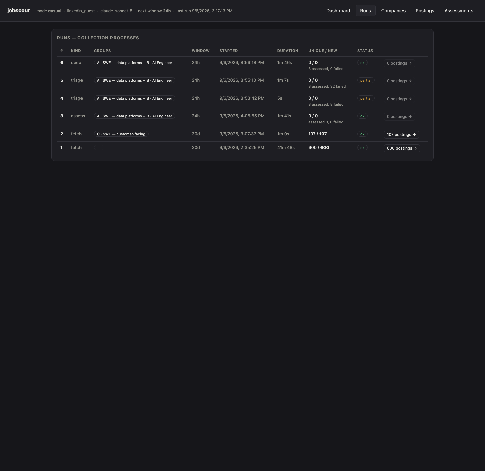

# jobscout

**An LLM-assisted job-triage tool.** It fetches fresh postings, scores each one against a
personal profile and a written rubric, and gives you a ranked shortlist with reasoning — turning
an evening of skimming into a few minutes of review.

CLI + local web app. Runs entirely on your machine; nothing is hosted, no data leaves your laptop.

Built with Claude Code as a study in doing LLM evaluation properly: a cheap pass to rank everything,
an expensive pass only where it matters, and a hand-labelled set to check the scoring against.

---

## How it works

```
   FETCH                TRIAGE                 DEEP                   YOU
   ─────                ──────                 ────                   ───
LinkedIn guest    →   batch-score all    →   full rubric on    →   review the
search, per          postings 0–100          the top ~15,          shortlist,
intent group        (overall / chance /      one call each         mark applied
                     quality) + area
  ~600 postings         ~600 scored          ~15 deep verdicts        ~5 to apply
```

- **Fetch** — a small set of saved searches, grouped by target area (e.g. "SWE on data", "AI engineer"). Dedupes against what it's already seen; pulls the full JD for anything new.
- **Triage** — one cheap batched LLM pass over everything: three 0–100 scores plus a coarse verdict. Enough to rank hundreds of postings for cents.
- **Deep-assess** — the full rubric on the top-scoring postings, one focused call each: verdict, target area with reasoning, skill-gap list, comp read, a company rating.
- **Review** — sort by score, open a posting, read the JD and the verdict side by side, mark it shortlisted / applied / passed.

The profile, the rubric, and the hand-labelled eval set live in a **separate private repo** — this
repo is just the engine, and ships with sanitized examples so it runs standalone.

---

## The app

`jobscout serve` → `http://127.0.0.1:8000`

**Dashboard** — run the whole pipeline from one place. Fetch (top) collects postings, Assess (bottom) scores them; each query group has its own Run button with live progress and a stop control.



**Postings** — everything collected. Filter by intent group, company, work type, seen / unseen, has-JD. Click a row for the full JD, the assessment, and status buttons.



**Assessments** — the scored shortlist. Every assessed posting with its verdict, area, and which model produced it. Sort by verdict or score.



**Companies** — one row per employer: posting counts, how many scored `pursue`, a manual 0–5 rating. Click through to that company's postings.



**Runs** — full history of every collection and scoring job: what it covered, how long it took, how many new postings or assessments it produced.



---

## Design notes

**Two-tier scoring.** Scoring every posting with the full rubric is slow and expensive. Scoring
nothing means no ranking. So: a batched triage pass gives every posting three cheap 0–100 scores —
enough to sort — and the full rubric only runs on the top slice. Most of the cost goes where the
decisions are.

**Pluggable providers.** The assessor is an interface, not a vendor. Groq (fast + free tier),
Gemini, any OpenAI-compatible endpoint (OpenRouter), or Claude — swap it in config.

**Local-first by necessity.** The LinkedIn guest endpoint is blocked from cloud IPs, so the whole
thing runs on your machine. That also keeps the profile and the postings off anyone's servers.

**Checked against ground truth.** A set of hand-scored JDs serves as an eval fixture for the
assessor — so prompt changes can be measured, not guessed at.

---

## Running it

```bash
make install                        # python venv + deps
cp config.example.yaml config.yaml  # edit: profile-repo paths, search queries
echo 'ASSESSOR_API_KEY=...' > .env  # a free Groq key (console.groq.com) drives the assessor
make build                          # build the React SPA into the package
make serve                          # API + UI at http://127.0.0.1:8000
```

CLI: `jobscout config`, `jobscout fetch`, `jobscout search "..."`, `jobscout serve`.

---

## How it's built

| | |
|---|---|
| Engine | Python — `config`, pluggable `sources/`, SQLite (`db`), `fetch` orchestration, `assess` |
| Source | LinkedIn guest endpoint (local only — cloud IPs are blocked); `jsearch` fallback |
| Assessor | pluggable LLM provider — Groq / Gemini / OpenRouter / Claude; batched triage + single-JD deep pass |
| Backend | FastAPI, in-process background run runner (one job at a time, cancellable) |
| Frontend | React + Vite SPA, built into the Python package and served by the backend |
| State | one SQLite file, gitignored |

See [`PLAN.md`](PLAN.md) for the roadmap and [`ASSESSOR.md`](ASSESSOR.md) for how the scoring prompt is built.
